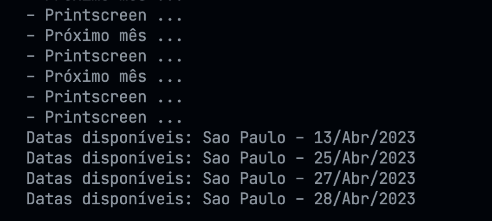

# Agendamento Visto Americano no Brasil

Script que automatiza a verificação de qual data mais próxima disponível para agendamento da entrevista do visto americano no Brasil

## Configuração

1. Instalar depenedências. Utilizar o Node 14+ e NPM 7+;

```bash
npm install
```

2. Edite a variável `setup` no arquivo `src/index.ts` adicionando suas credenciais (usuário e senha) e a cidade que você busca.

```typescript
const setup = {
  email: "seu-email@hotmail.com",
  password: "sua-senha",
  city: CITIES["Sao Paulo"],
};
```

A lista de cidades é:

- `Brasília`;
- `Porto Alegre`;
- `Recife`;
- `Rio de Janeiro`;
- `Sao Paulo`;

## Executar

```bash
npm start
```

Resultado


